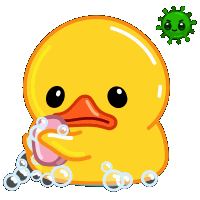
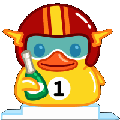
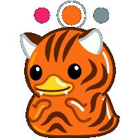

<!--
=================================================================
                 PDF TOOL BOT v2.0
       The Ultimate Telegram Document Engineering Suite
=================================================================
Live Demo  : https://t.me/pdfroxybot
GitHub     : https://github.com/RoxyBasicNeedBot/PDF-TOOL-BOT
Telegram   : https://t.me/roxybasicneedbot1
Website    : https://roxybasicneedbot.unaux.com/?i=1
YouTube    : @roxybasicneedbot
Portfolio  : https://aratt.ai/@roxybasicneedbot
(C) 2026 RoxyBasicNeedBot. All Rights Reserved.
=================================================================
-->

<div align="center">

  

  <br /><br />

  <p align="center">
    <a href="https://t.me/pdfroxybot">
      
    </a>
    <a href="https://t.me/roxybasicneedbot1">
      
    </a>
    <a href="https://roxybasicneedbot.unaux.com/?i=1">
      
    </a>
    <a href="https://t.me/roxycontactbot">
      
    </a>
  </p>

  <p align="center">
    <strong>The Ultimate Telegram Document Engineering Suite.</strong><br />
    <em>44 Atomic Operations &bull; Tesseract OCR &bull; Universal Converters &bull; 17 Languages &bull; Academic LibGen Hub</em>
  </p>

  <p align="center">
    <a href="#overview"><b>Overview</b></a> &bull;
    <a href="#features--capabilities"><b>Features</b></a> &bull;
    <a href="#44-operations-catalog"><b>44+ Ops</b></a> &bull;
    <a href="#commands-guide"><b>Commands</b></a> &bull;
    <a href="#deployment"><b>Deploy</b></a> &bull;
    <a href="#configuration--environment"><b>Configuration</b></a> &bull;
    <a href="#local-installation"><b>Setup</b></a>
  </p>

  <div align="center">
    
    
    
    
    
    
    
    
    
  </div>

</div>

<br />

<div align="center">
  
</div>

<br />

<div align="center">
  
  &nbsp;&nbsp;
  
  &nbsp;&nbsp;
  
  &nbsp;&nbsp;
  
  &nbsp;&nbsp;
  
  &nbsp;&nbsp;
  
</div>

<br />

##  Overview

**PDF TOOL BOT** is an asynchronous document engineering system built natively for Telegram. Powered by **Python 3.11**, **Kurigram** (asynchronous Pyrogram framework), **PyMuPDF (fitz)**, **Tesseract 5 OCR**, **Ghostscript**, and **Motor (async MongoDB)**, it delivers 44 production-grade document transformations with sub-second execution speeds and zero quality degradation.

Send any PDF file to the bot. An interactive inline keyboard generates dynamically. Select an operation, and the result is delivered back instantly.

> [!IMPORTANT]
> **Production Requirements:** Telegram Bot Token from @BotFather, API ID and API Hash from [my.telegram.org](https://my.telegram.org), an active MongoDB instance, and Ghostscript on the host system.

<br />

<div align="center">
  
</div>

<br />

##  Features & Capabilities

<div align="center">
<table>
  <tr>
    <!-- CARD 1: CORE PDF SURGERY -->
    <td width="50%" valign="top">
      <div align="left">
        <h3> Core PDF Surgery & Manipulation</h3>
        <p>
          
          
        </p>
        <ul>
          <li>
             <b>Multi-File Merge:</b> Send multiple PDF files into the active session queue and merge them into a single ordered master document.
          </li>
          <br />
          <li>
             <b>Precision Splitter:</b> Slice documents by arbitrary page ranges (e.g. <code>1-10</code>, <code>15,22,30</code>) or split on demand.
          </li>
          <br />
          <li>
             <b>Selective Page Extractor:</b> Isolate specific pages or chapters into a brand-new standalone PDF without quality loss.
          </li>
          <br />
          <li>
             <b>Page Deleter:</b> Remove unwanted blank sheets, copyright disclaimers, or cover pages by index.
          </li>
          <br />
          <li>
             <b>360 Degree Rotator:</b> Reorient orientation clockwise or counter-clockwise (<code>90 deg</code>, <code>180 deg</code>, <code>270 deg</code>, <code>360 deg</code>).
          </li>
          <br />
          <li>
             <b>Zoom & Margin Calibrator:</b> Dynamically scale document viewport bounding boxes with custom margin expansion.
          </li>
          <br />
          <li>
             <b>Form Field Flattening:</b> Convert dynamic, interactive fillable PDF forms into immutable static printable pages.
          </li>
          <br />
          <li>
             <b>Automatic Page Numbering:</b> Stamp uniform, sequential numbering across every page header or footer automatically.
          </li>
          <br />
          <li>
             <b>Bookmark & TOC Inspector:</b> Inspect and extract the embedded table-of-contents hierarchy from technical books and papers.
          </li>
          <br />
          <li>
             <b>Hyperlink Stripper:</b> Scrub all embedded promotional web links and tracking URLs with a single tap.
          </li>
          <br />
          <li>
             <b>Cover Page Preview:</b> Generate high-resolution graphical preview images of document cover pages.
          </li>
        </ul>
      </div>
    </td>
    <!-- CARD 2: COMPRESSION & VISUAL STYLING -->
    <td width="50%" valign="top">
      <div align="left">
        <h3> Smart Compression & Visual Studio</h3>
        <p>
          
          
        </p>
        <ul>
          <li>
             <b>Multi-Tier Compression:</b> Ghostscript backend engine with calculated size savings feedback:
            <ul>
              <li><code>Low (Best Quality)</code>: Uses <code>/printer</code> profile for high-res print outputs.</li>
              <li><code>Medium (Balanced)</code>: Uses <code>/ebook</code> profile for crystal-clear digital reading.</li>
              <li><code>High (Smallest Size)</code>: Uses <code>/screen</code> profile for compact email attachments.</li>
            </ul>
          </li>
          <br />
          <li>
             <b>Tri-Modal Watermark Studio:</b>
            <ul>
              <li><b>Text Watermark:</b> Custom text overlay with 10% to 100% opacity tuning and Top, Middle, or Bottom alignment.</li>
              <li><b>Image Watermark:</b> Stamp your personal logo or brand PNG directly across all pages.</li>
              <li><b>PDF Watermark:</b> Merge a transparent background template PDF under each page.</li>
            </ul>
          </li>
          <br />
          <li>
             <b>Official Stamp Presets:</b> 14 bureaucratic stamps (<i>Approved, Confidential, Top Secret, Draft, Expired, Final, Sold, For Public Release...</i>) across 6 colors (Red, Blue, Green, Yellow, Pink, Black).
          </li>
          <br />
          <li>
             <b>Dark Mode Inverter:</b> Inverts color schemes for comfortable reading in dark environments.
          </li>
          <br />
          <li>
             <b>Black & White Grayscale:</b> Converts documents into pure monochrome for ink-saving printing.
          </li>
          <br />
          <li>
             <b>Artistic Sketch Filter:</b> Transforms pages into stylized hand-drawn pencil sketches.
          </li>
          <br />
          <li>
             <b>Header & Footer Injector:</b> Injects custom text banners at top or bottom page margins.
          </li>
        </ul>
      </div>
    </td>
  </tr>
  <tr>
    <!-- CARD 3: UNIVERSAL CONVERTERS & N-UP -->
    <td width="50%" valign="top">
      <div align="left">
        <h3> Universal Converters & N-Up Imposition</h3>
        <p>
          
          
        </p>
        <ul>
          <li>
             <b>PDF to Microsoft Word (DOCX):</b> Converts documents into fully editable Word files with intact paragraphs and formatting.
          </li>
          <br />
          <li>
             <b>PDF to Microsoft Excel (XLSX):</b> Detects tabular layouts and extracts raw data directly into structured spreadsheets.
          </li>
          <br />
          <li>
             <b>PDF to PowerPoint (PPTX):</b> Transforms document presentation slides into editable PowerPoint decks.
          </li>
          <br />
          <li>
             <b>PDF to High-DPI Images:</b> Renders every page into PNG or JPEG image files. Export as single images, document formats, or compressed <code>.ZIP</code> / <code>.TAR</code> packages.
          </li>
          <br />
          <li>
             <b>Images to Single PDF:</b> Send multiple pictures (JPG, PNG) in chat and click generate to create an aggregated PDF document.
          </li>
          <br />
          <li>
             <b>Text to Formatted PDF:</b> Paste raw text directly into the bot to produce an elegant PDF with custom fonts and font sizes.
          </li>
          <br />
          <li>
             <b>Structured Text Extraction:</b> Exports embedded text as plain text (<code>.TXT</code>), web-ready markup (<code>.HTML</code>), or machine-readable <code>.JSON</code>.
          </li>
          <br />
          <li>
             <b>N-Up Sheet Imposition (Study Handouts):</b>
            <ul>
              <li><code>1 x 2</code> & <code>2 x 1</code>: Two pages per sheet (Horizontal / Vertical).</li>
              <li><code>1 x 3</code> & <code>3 x 1</code>: Three pages per sheet (Horizontal / Vertical).</li>
              <li><code>2 x 2</code>: Four pages per sheet in a compact 4-quadrant grid.</li>
            </ul>
          </li>
        </ul>
      </div>
    </td>
    <!-- CARD 4: OCR, RESEARCH & SECURITY -->
    <td width="50%" valign="top">
      <div align="left">
        <h3> OCR, Academic Research & Security</h3>
        <p>
          
          
        </p>
        <ul>
          <li>
             <b>Tesseract 5 OCR Engine:</b> Converts scanned, photographed, or unselectable PDFs into copyable, searchable text layers without distortion.
          </li>
          <br />
          <li>
             <b>Library Genesis (LibGen) Research Hub:</b> Search academic research papers, journals, and books directly from Telegram with mirror selection and Cloudflare bypass.
          </li>
          <br />
          <li>
             <b>Web URL to PDF Ingest:</b> Send direct download links or document URLs; the bot fetches and converts them into Telegram documents automatically.
          </li>
          <br />
          <li>
             <b>Telegram Message to PDF:</b> Render formatted Telegram messages into clean PDF documents.
          </li>
          <br />
          <li>
             <b>Cryptographic AES Encryption:</b> Lock documents with user and owner passwords via military-grade AES-256 encryption.
          </li>
          <br />
          <li>
             <b>Instant Password Decryption:</b> Remove password restrictions from your owned protected files.
          </li>
          <br />
          <li>
             <b>Irreversible Redaction:</b> Permanently black out confidential data, names, figures, and sensitive sections before public distribution.
          </li>
          <br />
          <li>
             <b>Digital Signature:</b> Insert verified signature blocks and embed dynamic scannable QR codes anywhere on your pages.
          </li>
          <br />
          <li>
             <b>QR Code Stamping:</b> Synthesizes and stamps a custom QR code onto pages.
          </li>
          <br />
          <li>
             <b>Unified AIO (All-in-One) Pipeline:</b> Handles password-protected files and applies continuous chains of operations (decrypt, compress, watermark, rename) in a single session.
          </li>
          <br />
          <li>
             <b>Deep Linking & Shareable URLs:</b> Generate secure Telegram deep links allowing others to open specific processed files right inside the bot.
          </li>
        </ul>
      </div>
    </td>
  </tr>
</table>
</div>

<br />

<div align="center">
  
</div>

<br />

##  44+ Operations Catalog

Every operation implemented directly in the source code (<code>dispatch/reactor/ops/</code>):

<details>
<summary><b>Click to expand the complete 44+ Operations Catalog</b></summary>

<br />

### 1. Document Architecture & Assembly
| File | Operation | Description |
|---|---|---|
| `pdf_merge.py` |  **Merge** | Concatenates multiple PDF files into one ordered master file |
| `pdf_split.py` |  **Split** | Slices PDF documents by custom page range or specific pages |
| `pdf_extract.py` |  **Extract** | Pulls out designated pages into a new standalone PDF |
| `pdf_combine.py` |  **Combine** | Interleaves and combines disparate page batches |
| `pdf_deletepage.py` |  **Delete Page** | Removes unwanted single pages or ranges by index |
| `pdf_compress.py` |  **Compress** | Ghostscript compression: Low (<code>/printer</code>), Medium (<code>/ebook</code>), High (<code>/screen</code>) |
| `pdf_rotate.py` |  **Rotate** | Corrects document orientation: 90 deg, 180 deg, 270 deg, 360 deg |
| `pdf_zoom.py` |  **Zoom** | Adjusts inner page zoom scale and border padding margins |
| `pdf_rename.py` |  **Rename** | Safely renames files without modifying internal binary payloads |
| `pdf_preview.py` |  **Preview** | Renders high-fidelity graphical preview of the cover page |
| `pdf_metadata.py` |  **Metadata** | Inspects document metadata (Title, Author, Subject, Keywords, Creator) |
| `pdf_flatten.py` |  **Flatten** | Flattens interactive form fields into static immutable pages |
| `pdf_pagenum.py` |  **Page Numbers** | Automatically inserts page numbers across every page |
| `pdf_bookmarks.py` |  **Bookmarks** | Reads and exports the document Table of Contents outline |
| `pdf_striplinks.py` |  **Strip Links** | Purges all clickable hyperlinks and tracking URLs from pages |

### 2. Visual Enhancements & Artistry
| File | Operation | Description |
|---|---|---|
| `pdf_bw.py` |  **Black & White** | Converts color pages to ink-saving monochrome grayscale |
| `pdf_invert.py` |  **Invert Colors** | Inverts colors for eye-friendly dark/night mode reading |
| `pdf_saturate.py` |  **Saturate** | Adjusts color vibrancy and saturation levels |
| `pdf_draw.py` |  **Draw / Sketch** | Applies an artistic pencil-sketch visual filter |

### 3. Watermarking, Stamps & Identity
| File | Operation | Description |
|---|---|---|
| `pdf_watermark.py` |  **Watermark (Text/Image/PDF)** | Full watermark engine with 10% to 100% opacity and Top/Mid/Bottom alignment |
| `pdf_watermark45.py` |  **Watermark 45 deg** | Classic diagonal 45-degree watermark positioning |
| `pdf_stamp.py` |  **Official Stamp** | 14 official bureaucratic stamps in 6 selectable colors |
| `pdf_header.py` |  **Header** | Injects custom banner text across top page margins |
| `pdf_footer.py` |  **Footer** | Injects custom banner text across bottom page margins |
| `pdf_redact.py` |  **Redact** | Permanently censors and blacks out sensitive document regions |
| `pdf_sign.py` |  **Digital Sign** | Inserts a visual signature block for document approval |
| `pdf_qr.py` |  **QR Code** | Synthesizes and stamps a custom QR code onto pages |

### 4. Sheet Imposition (N-Up Layouts)
| File | Operation | Description |
|---|---|---|
| `pdf_format.py` |  **Format Hub** | Master selection router for 1x1, 1x2, 2x1, 1x3, 3x1, 2x2 |
| `pdf_2in1.py` |  **2-in-1 Vertical** | 2 pages printed vertically on a single sheet |
| `pdf_2in1h.py` |  **2-in-1 Horizontal** | 2 pages printed horizontally on a single sheet |
| `pdf_3in1.py` |  **3-in-1 Vertical** | 3 pages printed vertically on a single sheet |
| `pdf_3in1h.py` |  **3-in-1 Horizontal** | 3 pages printed horizontally on a single sheet |

### 5. Format Conversion & Data Extraction
| File | Operation | Description |
|---|---|---|
| `pdf_to_word.py` |  **PDF to DOCX** | Headless LibreOffice conversion to editable Microsoft Word |
| `pdf_to_excel.py` |  **PDF to XLSX** | Extracts tabular layouts into Microsoft Excel spreadsheets |
| `pdf_to_ppt.py` |  **PDF to PPTX** | Converts presentation slides into editable PowerPoint files |
| `pdf_to_images.py` |  **PDF to Images** | Converts pages to PNG/JPEG images (Individual, Document, ZIP, TAR) |
| `pdf_text.py` |  **PDF to Text** | Extracts document text and exports as TXT, HTML, or JSON |
| `pdf_encrypt.py` |  **Encrypt** | Applies cryptographic password lock with AES-256 |
| `pdf_decrypt.py` |  **Decrypt** | Unlocks encrypted PDFs using verified user password |
| `pdf_archive.py` |  **Archive** | Bundles and compresses PDF files into ZIP or TAR archives |

### 6. OCR, Intelligence & Academic Search
| File | Operation | Description |
|---|---|---|
| `pdf_ocr.py` |  **Tesseract OCR** | Converts non-selectable scanned PDFs into searchable text documents |
| `pdf_deeplink.py` |  **Deep Link** | Generates shareable bot deep links to retrieve stored documents |
| `pdf_message.py` |  **Message to PDF** | Converts long chat text messages into clean PDF documents |
| `fetcher.py` |  **URL Downloader** | Direct remote HTTP/HTTPS document fetcher |
| `finder.py` |  **LibGen Search** | Library Genesis paper & book search with Cloudflare bypass |

</details>

<br />

<div align="center">
  
</div>

<br />

##  Commands Guide

### User Commands

| Command | Action | Details |
|:---:|---|---|
| `/start` |  **Initialize Bot** | Displays welcome panel, language detection, and quick setup guide |
| `/lang` |  **Change Language** | Opens language selection menu supporting 17 international languages |
| `/help` |  **Operations Guide** | Explains available features and gives direct inline keyboard tips |

> [!NOTE]
> **No Command Memorization Needed:** Simply upload any PDF document to the bot. An interactive inline keyboard appears with instant buttons for every tool.

### Administrator Commands

| Command | Syntax | Description |
|:---:|---|---|
| `/stats` | `/stats` |  Displays real-time server health (Disk storage, RAM usage, CPU load, Active database users) |
| `/ban` | `/ban <user_id>` |  Permanently bans a user from accessing the bot infrastructure |
| `/unban` | `/unban <user_id>` |  Restores access permissions for a previously banned user |
| `/donate` | `/donate` |  Displays donation and support options |

<br />

<div align="center">
  
</div>

<br />

##  17 Supported Languages

Full localized interface covering menus, buttons, status indicators, and prompts:

<div align="center">

| Language | Code | Language | Code | Language | Code |
|---|:---:|---|:---:|---|:---:|
| **English** | `en` | **Hindi** (Hindi) | `hi` | **Arabic** (Arabic) | `ar` |
| **Spanish** (Espanol) | `es` | **French** (Francais) | `fr` | **German** (Deutsch) | `de` |
| **Russian** (Russian) | `ru` | **Chinese** (Chinese) | `zh` | **Japanese** (Japanese) | `ja` |
| **Portuguese** (Portugues) | `pt` | **Korean** (Korean) | `ko` | **Italian** (Italiano) | `it` |
| **Turkish** (Turkce) | `tr` | **Persian** (Farsi) | `fa` | **Bengali** (Bengali) | `bn` |
| **Urdu** (Urdu) | `ur` | **Indonesian** (Bahasa) | `id` | | |

</div>

<br />

<div align="center">
  
</div>

<br />

##  Deployment

Deploy your own high-performance instance with a single click:

<div align="center">
<table>
  <thead>
    <tr>
      <th align="center">Render</th>
      <th align="center">Koyeb</th>
      <th align="center">Railway</th>
      <th align="center">Heroku</th>
    </tr>
  </thead>
  <tbody>
    <tr>
      <td align="center">
        <a href="https://render.com/deploy?repo=https://github.com/RoxyBasicNeedBot/PDF-TOOL-BOT">
          
        </a>
      </td>
      <td align="center">
        <a href="https://app.koyeb.com/deploy?type=git&repository=github.com/RoxyBasicNeedBot/PDF-TOOL-BOT&branch=main&name=pdf-tool-bot">
          
        </a>
      </td>
      <td align="center">
        <a href="https://railway.app/new/template?template=https://github.com/RoxyBasicNeedBot/PDF-TOOL-BOT">
          
        </a>
      </td>
      <td align="center">
        <a href="https://heroku.com/deploy?template=https://github.com/RoxyBasicNeedBot/PDF-TOOL-BOT">
          
        </a>
      </td>
    </tr>
  </tbody>
</table>
</div>

<br />

<div align="center">
  
</div>

<br />

##  Configuration & Environment

Copy the template and fill in your credentials:

```bash
cp config.env.example config.env
```

### Core Variables (Required)

| Variable | Type | Description |
|---|:---:|---|
| `B_TOKEN` | `String` | Telegram Bot Token obtained from [@BotFather](https://t.me/BotFather) |
| `API_ID` | `Integer` | Telegram API App ID from [my.telegram.org](https://my.telegram.org) |
| `API_HASH` | `String` | Telegram API Hash string from [my.telegram.org](https://my.telegram.org) |
| `MONGODB_URI` | `String` | MongoDB connection URI (<code>mongodb+srv://...</code>) for storing user preferences |
| `ADMINS` | `String` | Space-separated Telegram user IDs who have admin permissions |

### Optional Configuration

| Variable | Type | Default | Description |
|---|:---:|:---:|---|
| `LOG_CHANNEL` | `Integer` | `None` | Telegram channel ID to receive operational and error logs |
| `FORCE_SUB` | `String` | `None` | Telegram channel username for compulsory subscription verification |
| `FORCE_SUB2` | `String` | `None` | Second channel username for dual force-subscription check |
| `MAX_FILE_SIZE` | `Integer` | `200` | Maximum allowable input file size in megabytes (MB) |
| `MULTI_LANG_SUP` | `Boolean` | `True` | Automatically detect client language from user profile |
| `SOURCE_CODE` | `String` | `""` | Repository URL displayed in information and about panels |
| `OWNED_CHANNEL` | `String` | `""` | Official updates channel URL linked in menus |
| `PORT` | `Integer` | `8080` | Keep-alive HTTP pulse server port for Render and Koyeb platforms |

<br />

<div align="center">
  
</div>

<br />

##  Local Installation

### Prerequisites
-  **Python 3.11+**
-  **Ghostscript** (<code>gs</code> binary for PDF level-compression)
-  **Tesseract OCR** (<code>tesseract</code> engine for OCR text layer generation)
-  **LibreOffice** (Headless engine for DOCX, XLSX, PPTX conversion)

```bash
# 1. Clone repository
git clone https://github.com/RoxyBasicNeedBot/PDF-TOOL-BOT.git
cd PDF-TOOL-BOT

# 2. Setup virtual environment
python -m venv venv
venv\Scripts\activate          # Windows PowerShell / CMD
# source venv/bin/activate     # Linux / macOS

# 3. Install dependencies
pip install -r requirements.txt

# 4. Configure environment
cp config.env.example config.env
# Edit config.env with your real credentials

# 5. Start the bot
python -m ROXYBASICNEEDBOT
```

<br />

<div align="center">
  
</div>

<br />

##  Acknowledgments

-  [**PyMuPDF (fitz)**](https://pymupdf.readthedocs.io) - High-performance C-backed PDF rendering and manipulation library
-  [**Kurigram**](https://github.com/KuriGohan-Kamehameha/Kurigram) - Asynchronous Pyrogram MTProto client fork
-  [**Tesseract OCR**](https://github.com/tesseract-ocr/tesseract) - World-class optical character recognition engine
-  [**Ghostscript**](https://www.ghostscript.com) - PostScript and PDF compression engine
-  [**LibreOffice**](https://www.libreoffice.org) - Headless office document conversion system
-  [**Motor**](https://motor.readthedocs.io) - Asynchronous MongoDB driver for Python

<br />

<div align="center">
  
</div>

<br />

<!-- ==================== PREMIUM FOOTER ==================== -->
<div align="center">

  <p align="center">
    
    &nbsp;&nbsp;&nbsp;&nbsp;
    
    &nbsp;&nbsp;&nbsp;&nbsp;
    
    &nbsp;&nbsp;&nbsp;&nbsp;
    
  </p>

  <br />

  <p align="center">
    <a href="https://t.me/pdfroxybot">
      
    </a>
    &nbsp;
    <a href="https://github.com/RoxyBasicNeedBot/PDF-TOOL-BOT/stargazers">
      
    </a>
    &nbsp;
    <a href="https://github.com/RoxyBasicNeedBot/PDF-TOOL-BOT/network/members">
      
    </a>
    &nbsp;
    <a href="https://t.me/roxybasicneedbot1">
      
    </a>
    &nbsp;
    <a href="https://roxybasicneedbot.unaux.com/?i=1">
      
    </a>
  </p>

  <p align="center">
    <a href="#overview">Back to Top</a> &bull;
    <a href="https://github.com/RoxyBasicNeedBot/PDF-TOOL-BOT/issues">Report Issue</a> &bull;
    <a href="https://github.com/RoxyBasicNeedBot/PDF-TOOL-BOT/pulls">Submit Pull Request</a>
  </p>

  <p align="center">
    <strong>If PDF TOOL BOT improved your workflow, consider giving it a Star on GitHub.</strong>
  </p>

  <sub>(C) 2026 <a href="https://t.me/roxybasicneedbot1">RoxyBasicNeedBot</a>. All Rights Reserved.</sub>

</div>

<!--
=================================================================
                 PDF TOOL BOT v2.0
Live Demo  : https://t.me/pdfroxybot
GitHub     : https://github.com/RoxyBasicNeedBot/PDF-TOOL-BOT
Telegram   : https://t.me/roxybasicneedbot1
(C) 2026 RoxyBasicNeedBot. All Rights Reserved.
=================================================================
-->
